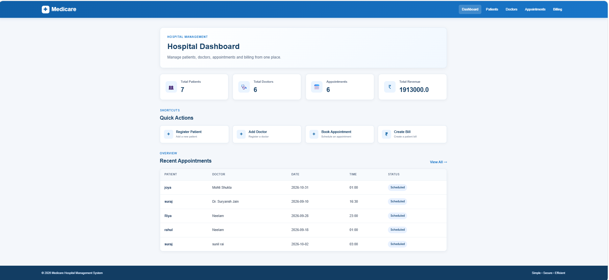
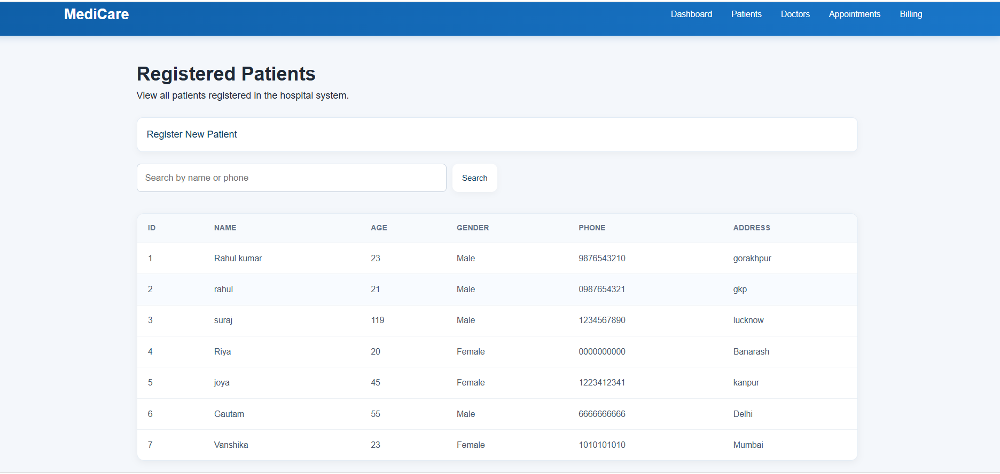
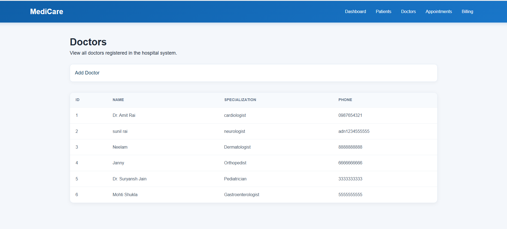
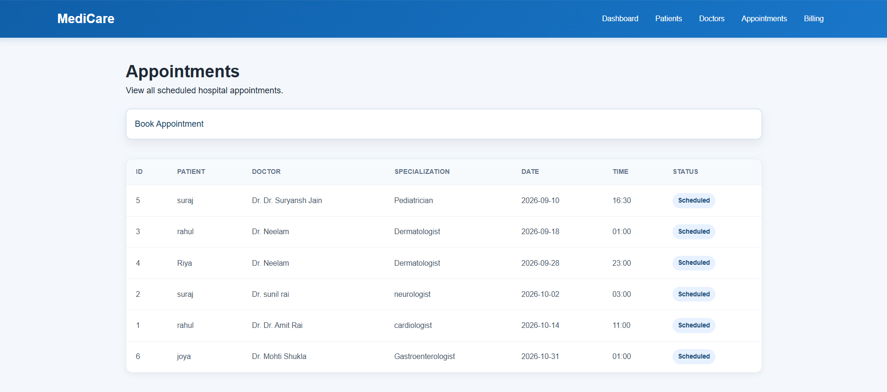
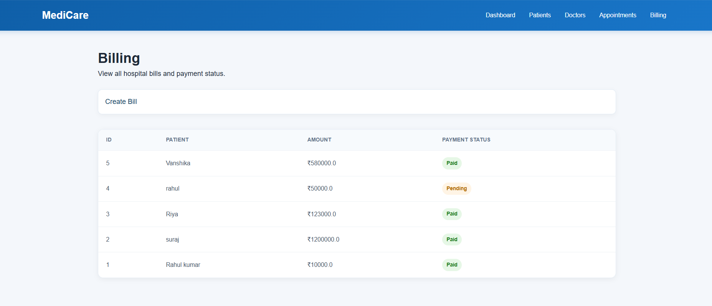

# Hospital Management System

A web-based Hospital Management System developed using Python, Flask, HTML, CSS, and SQLite.

This project provides a simple interface for managing patients, doctors, appointments, and billing information.

## Features

- Hospital dashboard
- Patient registration
- Patient search
- Doctor registration and management
- Appointment booking
- Billing management
- Paid/Pending payment status
- Form validation
- Flash messages for success and errors
- Responsive user interface
- SQLite database

## Technologies Used

- Python
- Flask
- SQLite
- HTML5
- CSS3
- Git
- GitHub

## Project Structure

```text
Hospital_Management_System/
│
├── app.py
├── database.py
├── .gitignore
│
├── static/
│   └── css/
│       └── style.css
│
└── templates/
    ├── index.html
    ├── add_patient.html
    ├── patients.html
    ├── add_doctor.html
    ├── doctors.html
    ├── add_appointment.html
    ├── appointments.html
    ├── add_bill.html
    └── billing.html
```

## Installation and Setup

### 1. Clone the repository

```bash
git clone https://github.com/madhu100706/Hospital_Management_System.git
```

### 2. Open the project folder

```bash
cd Hospital_Management_System
```

### 3. Install Flask

```bash
py -m pip install flask
```

### 4. Run the application

```bash
py app.py
```

The application will run locally at:

```text
http://127.0.0.1:5000
```

## Database

The project uses SQLite for storing:

- Patient information
- Doctor information
- Appointment information
- Billing information

The database tables are automatically created when the application starts.

## Screenshots

### Dashboard



### Patient Management



### Doctor Management



### Appointments



### Billing



## Project Purpose

This project was developed as part of a Python programming internship to practice web application development using Flask, database integration, HTML, CSS, form handling, and Git/GitHub.

## Author

**Madhu**

GitHub: [madhu100706](https://github.com/madhu100706/Hospital_Management_System)
